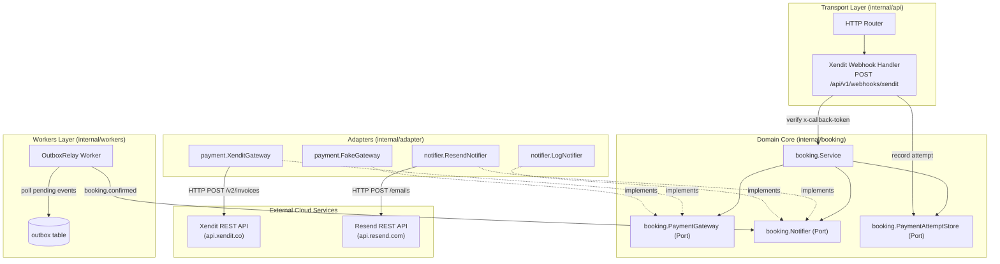
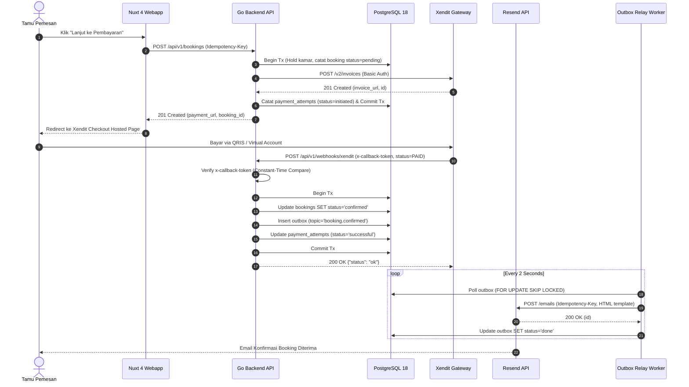

# Technical Architecture & Engineering Design
# Integrasi Payment Gateway Xendit & Notifikasi Outbox Resend
**Properti:** Hotel Pulang ke Uttara, Yogyakarta (95 Kamar)  
**Dokumen ID:** `TECH-XENDIT-RESEND-2026-10-03`  
**Versi:** 1.0.0  
**Tanggal:** 2026-10-03  
**Status:** Approved / Ready for Execution  

---

## 1. Arsitektur Komponen & Hexagonal Ports



---

## 2. Diagram Alur Transaksi & Webhook (Sequence Diagram)



---

## 3. Desain Komponen & Pola Rekayasa

### 3.1 Xendit Gateway Adapter (`internal/adapter/payment/xendit.go`)
* **Struct:**
  ```go
  type XenditGateway struct {
      BaseURL       string
      SecretKey     string
      WebhookToken  string
      AppBaseURL    string
      Client        *http.Client
      Log           *slog.Logger
  }
  ```
* **Kepatuhan OWASP API:**
  Verifikasi `x-callback-token` menggunakan `subtle.ConstantTimeCompare([]byte(headerToken), []byte(g.WebhookToken)) == 1` untuk mencegah kerentanan *timing attack*.

### 3.2 Resend Notifier Adapter (`internal/adapter/notifier/resend.go`)
* **Struct:**
  ```go
  type ResendNotifier struct {
      BaseURL   string
      APIKey    string
      FromEmail string
      Client    *http.Client
      Log       *slog.Logger
  }
  ```
* **Template HTML Brand:**
  Dirancang dengan tipografi bersih, palet warna hotel (#2D2B2A, #F7F5F0, #9B4A2C), menampilkan nomor reservasi, tipe kamar, durasi menginap, serta kontak bantuan tamu.

### 3.3 Anti-Overengineering (Prinsip Ponytail)
* Murni menggunakan standard library Go `net/http` dengan `http.Client{Timeout: 10 * time.Second}`.
* Menggunakan `httptest.Server` untuk unit testing adapter tanpa koneksi eksternal langsung saat CI/test suite.
* Konfigurasi graceful fallback: Jika kredensial Xendit/Resend kosong pada mode development, server otomatis memakai `FakeGateway` dan `LogNotifier` sehingga developer tidak dipaksa memiliki API key nyata untuk menjalankan server lokal.
