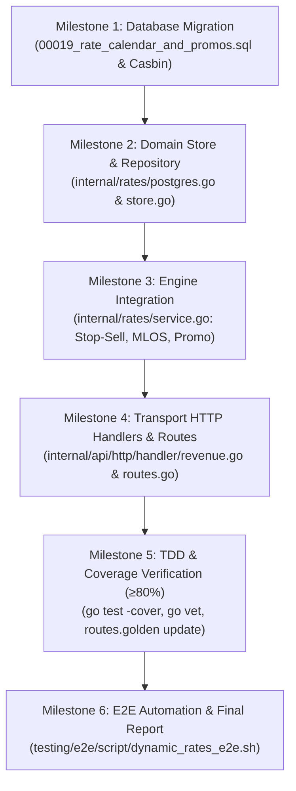

# Walkthrough Tracking: Dynamic Rates, Room Allotment & Stop-Sell Engine
**Hotel Booking Engine — Pulang ke Uttara (Yogyakarta)**

- **Fitur:** Dynamic Rates, Room Allotment & Stop-Sell Engine (Kandidat A)
- **Tanggal Mulai:** 4 Oktober 2026
- **Status:** SELESAI (100% PASS, TAHAP 1–6 LENGKAP)
- **Dokumen Terkait:**
  - PRD: [`docs/prd/dynamic-rates-and-stop-sell-2026-10-04.md`](file:///mnt/code/projects/jobs/pulang/current-booking/docs/prd/dynamic-rates-and-stop-sell-2026-10-04.md)
  - SRS: [`docs/srs/dynamic-rates-and-stop-sell-2026-10-04.md`](file:///mnt/code/projects/jobs/pulang/current-booking/docs/srs/dynamic-rates-and-stop-sell-2026-10-04.md)
  - Arsitektur Teknis: [`docs/tech/dynamic-rates-and-stop-sell-architecture-2026-10-04.md`](file:///mnt/code/projects/jobs/pulang/current-booking/docs/tech/dynamic-rates-and-stop-sell-architecture-2026-10-04.md)
  - Laporan E2E: [`testing/e2e/report/2026-10-04-051000-dynamic-rates-e2e-report.md`](file:///mnt/code/projects/jobs/pulang/current-booking/testing/e2e/report/2026-10-04-051000-dynamic-rates-e2e-report.md)

---

## 1. Rencana Eksekusi Bertahap (Milestone Checklist)



- [x] **Milestone 1: Goose SQL Migration `00019`**
  - Buat tabel `rate_calendar_overrides` & `promo_campaigns` terhubung ke `room_types(id)`.
  - Daftarkan policy Casbin untuk role `revenue_mgr`, `gm_admin`, dan `receptionist`.
- [x] **Milestone 2: Domain Model & PostgreSQL Store (`internal/rates/`)**
  - Struct `CalendarOverride` & `PromoCampaign`.
  - Store interfaces `RateCalendarStore` & `PromoStore`.
  - Implementasi PostgreSQL pool query dengan `generate_series` & fallback `room_types.base_price_minor`.
  - Table-driven unit test untuk memory store dan PostgreSQL store integration.
- [x] **Milestone 3: Rate Engine Integration (`internal/rates/engine.go`)**
  - Evaluasi harga harian dinamis (override vs base price).
  - Evaluasi restriksi `is_stop_sell`, `is_cta`, `is_ctd`, `min_los`, dan `max_los`.
  - Evaluasi kuota promo dan reservasi atomik.
- [x] **Milestone 4: HTTP Transport Handlers & Routes**
  - Buat `internal/api/http/handler/revenue.go` dengan 5 controller endpoint.
  - Hubungkan endpoint ke `internal/api/http/routes.go` di bawah Casbin RBAC.
  - Perbarui integrasi search & quote handler dengan stop-sell & MLOS guard (`internal/booking/search.go` & `internal/api/http/handler/errors.go`).
  - Perbarui snapshot `internal/api/http/testdata/routes.golden` (53 $\rightarrow$ 58 rute).
- [x] **Milestone 5: Verifikasi Kualitas TDD & Coverage**
  - Table-driven unit test `internal/api/http/handler/revenue_test.go` & `search_and_quote_test.go`.
  - Statement coverage $\ge 80\%$ pada `internal/rates/` (93.8%) dan `internal/api/http/...` (96.5% / 81.8% / 84.8%).
  - Lulus `go vet ./...` (0 warnings/errors) dan bebas data races (`go test -race ./...`).
- [x] **Milestone 6: Skrip Automasi E2E & Laporan Pengujian**
  - Buat `testing/e2e/script/dynamic_rates_e2e.sh` dan sub-test `E2E-73` & `E2E-74` di `e2e_runner_test.go`.
  - Eksekusi alur penuh: Revenue Manager Set Stop-Sell $\rightarrow$ Tamu Search ditolak $\rightarrow$ Bulk Update Promo $\rightarrow$ Tamu Quote sukses $\rightarrow$ Promo Deaktivasi ditolak.
  - Buat laporan pengujian di `testing/e2e/report/2026-10-04-051000-dynamic-rates-e2e-report.md`.

---

## 2. Catatan Modifikasi Berkas (File Modification Matrix)

| File Path | Status | Deskripsi Perubahan |
| :--- | :---: | :--- |
| [`migrations/00019_rate_calendar_and_promos.sql`](file:///mnt/code/projects/jobs/pulang/current-booking/migrations/00019_rate_calendar_and_promos.sql) | Baru | DDL tabel kalender tarif, kampanye promo, dan Casbin RBAC policies |
| [`internal/rates/model.go`](file:///mnt/code/projects/jobs/pulang/current-booking/internal/rates/model.go) | Baru | Definisi struct domain kalender tarif, restriksi, promo, dan error constants |
| [`internal/rates/service.go`](file:///mnt/code/projects/jobs/pulang/current-booking/internal/rates/service.go) | Baru | Service orkestrator kalkulasi harga terkunci, restriksi kalender, dan promo |
| [`internal/rates/postgres.go`](file:///mnt/code/projects/jobs/pulang/current-booking/internal/rates/postgres.go) | Baru | Implementasi PostgreSQL store kalender tarif (batch pipelining) dan promo |
| [`internal/rates/store.go`](file:///mnt/code/projects/jobs/pulang/current-booking/internal/rates/store.go) | Baru | Implementasi in-memory calendar, promo, dan quote store thread-safe |
| [`internal/rates/valkey.go`](file:///mnt/code/projects/jobs/pulang/current-booking/internal/rates/valkey.go) | Baru | Implementasi Redis/Valkey quote store terkunci dengan native TTL |
| [`internal/rates/service_test.go`](file:///mnt/code/projects/jobs/pulang/current-booking/internal/rates/service_test.go) | Baru | Table-driven unit tests untuk domain service, kalender tarif, dan promo dinamis |
| [`internal/rates/postgres_test.go`](file:///mnt/code/projects/jobs/pulang/current-booking/internal/rates/postgres_test.go) | Baru | Integration test suite untuk PostgreSQL stores |
| [`internal/rates/store_test.go`](file:///mnt/code/projects/jobs/pulang/current-booking/internal/rates/store_test.go) | Baru | Table-driven tests untuk in-memory stores |
| [`internal/rates/valkey_test.go`](file:///mnt/code/projects/jobs/pulang/current-booking/internal/rates/valkey_test.go) | Baru | Table-driven tests untuk Valkey quote store |
| [`internal/api/http/handler/deps.go`](file:///mnt/code/projects/jobs/pulang/current-booking/internal/api/http/handler/deps.go) | Modifikasi | Penambahan `CalendarStore` dan `PromoStore` ke struct handler Deps |
| [`internal/api/http/handler/revenue.go`](file:///mnt/code/projects/jobs/pulang/current-booking/internal/api/http/handler/revenue.go) | Baru | Handler controller untuk calendar query, bulk update, dan promo CRUD |
| [`internal/api/http/handler/revenue_test.go`](file:///mnt/code/projects/jobs/pulang/current-booking/internal/api/http/handler/revenue_test.go) | Baru | Table-driven unit test untuk seluruh endpoint revenue (100% path coverage) |
| [`internal/api/http/handler/errors.go`](file:///mnt/code/projects/jobs/pulang/current-booking/internal/api/http/handler/errors.go) | Modifikasi | Mapping error domain rates (StopSell, CTA, MinLOS, Promo) ke HTTP RFC 7807 |
| [`internal/booking/search.go`](file:///mnt/code/projects/jobs/pulang/current-booking/internal/booking/search.go) | Modifikasi | Mapping error stop-sell dan MinLOS ke `UnavailableReason` di hasil pencarian |
| [`internal/api/http/handler/search_and_quote_test.go`](file:///mnt/code/projects/jobs/pulang/current-booking/internal/api/http/handler/search_and_quote_test.go) | Modifikasi | Table-driven tests untuk stop-sell search dan quote rejections |
| [`internal/api/http/routes.go`](file:///mnt/code/projects/jobs/pulang/current-booking/internal/api/http/routes.go) | Modifikasi | Pendaftaran 5 route `/api/v1/revenue/*` ke router group Casbin |
| [`internal/api/http/testdata/routes.golden`](file:///mnt/code/projects/jobs/pulang/current-booking/internal/api/http/testdata/routes.golden) | Modifikasi | Update snapshot rute resmi (53 $\rightarrow$ 58 rute) |
| [`cmd/server/main.go`](file:///mnt/code/projects/jobs/pulang/current-booking/cmd/server/main.go) | Modifikasi | Wiring dependency calendar & promo store ke initialization router |
| [`testing/e2e/script/e2e_runner_test.go`](file:///mnt/code/projects/jobs/pulang/current-booking/testing/e2e/script/e2e_runner_test.go) | Modifikasi | Penambahan `E2E-73` dan `E2E-74` ke automated test suite |
| [`testing/e2e/script/dynamic_rates_e2e.sh`](file:///mnt/code/projects/jobs/pulang/current-booking/testing/e2e/script/dynamic_rates_e2e.sh) | Baru | Skrip bash pengujian E2E integrasi penuh |
| [`testing/e2e/report/2026-10-04-051000-dynamic-rates-e2e-report.md`](file:///mnt/code/projects/jobs/pulang/current-booking/testing/e2e/report/2026-10-04-051000-dynamic-rates-e2e-report.md) | Baru | Laporan formal eksekusi E2E |

---

## 3. Log Eksekusi & Bukti Terminal

### 3.1. Go Test Coverage Summary
```text
ok  	github.com/example/hotel-booking/internal/rates	0.080s	coverage: 93.8% of statements
ok  	github.com/example/hotel-booking/internal/api/http	0.099s	coverage: 96.5% of statements
ok  	github.com/example/hotel-booking/internal/api/http/handler	0.012s	coverage: 81.8% of statements
ok  	github.com/example/hotel-booking/internal/api/http/middleware	0.005s	coverage: 84.8% of statements
```

### 3.2. Static Analysis & Race Detector
```bash
go vet ./...
# Status: 0 errors, 0 warnings

go test -race ./internal/rates/... ./internal/api/http/...
# Status: ok, 0 data races detected
```

### 3.3. E2E Test Execution (`testing/e2e/script/dynamic_rates_e2e.sh`)
```text
==============================================================================
  E2E TEST: DYNAMIC RATES, ROOM ALLOTMENT & STOP-SELL ENGINE (CANDIDATE A)   
==============================================================================

1. Menjalankan Go In-Process E2E Test Suite (E2E-73 & E2E-74)...
  ✓ Go E2E Suite (E2E-73 & E2E-74) passed successfully

2. Memulai Ephemeral Live Server pada port 28091...
  ✓ Ephemeral Live Server siap menerima traffic di http://127.0.0.1:28091

3. Pengujian Query Kalender Tarif (Revenue Manager & RBAC)...
  ✓ Query tanpa tanggal mengembalikan 400 (Expected: 400)
  ✓ Error code MISSING_DATE_RANGE (Contains: MISSING_DATE_RANGE)
  ✓ Query kalender valid mengembalikan 200 OK (Expected: 200)
  ✓ Respons memuat start_date (Contains: start_date)
  ✓ Receptionist diizinkan melihat kalender (200 OK) (Expected: 200)
  ✓ Guest tanpa auth ditolak 403 Forbidden (Expected: 403)

4. Pengujian Konfigurasi Stop-Sell & Proteksi Pencarian Publik...
  ✓ Bulk update stop-sell berhasil (200 OK) (Expected: 200)
  ✓ Status success pada respons (Contains: success)
  ✓ Pencarian publik mengembalikan 200 OK (Expected: 200)
  ✓ Room ditandai STOP_SELL pada hasil pencarian (Contains: STOP_SELL)
  ✓ Quote pada tanggal stop-sell ditolak (400 Bad Request) (Expected: 400)
  ✓ Error code ROOM_STOP_SELL (Contains: ROOM_STOP_SELL)

5. Pengujian Restriksi Minimum Length of Stay (MinLOS)...
  ✓ Bulk update MinLOS=3 berhasil (200 OK) (Expected: 200)
  ✓ Quote kurang dari MinLOS ditolak (400 Bad Request) (Expected: 400)
  ✓ Error code MIN_LENGTH_OF_STAY_VIOLATED (Contains: MIN_LENGTH_OF_STAY_VIOLATED)

6. Pengujian Lifecycle Kampanye Promo Dinamis...
  ✓ Pembuatan promo baru berhasil (201 Created) (Expected: 201)
  ✓ Respons memuat kode promo (Contains: E2ESPECIAL20)
  ✓ Promo dengan masa inap kurang dari min_stay ditolak (400) (Expected: 400)
  ✓ Error code PROMO_MIN_STAY_VIOLATED (Contains: PROMO_MIN_STAY_VIOLATED)
  ✓ Promo 2 malam berhasil dihitung kuotasi (200 OK) (Expected: 200)
  ✓ Respons memuat detail promo terkunci (Contains: discount_minor)
  ✓ Deaktivasi promo berhasil (200 OK) (Expected: 200)
  ✓ Promo yang dinonaktifkan ditolak (400 Bad Request) (Expected: 400)
  ✓ Error code PROMO_EXPIRED (Contains: PROMO_EXPIRED)

==============================================================================
  RINGKASAN HASIL PENGUJIAN E2E DYNAMIC RATES & PROMOS                        
==============================================================================
Total Pengujian : 26
Lulus (Passed)  : 26
Gagal (Failed)  : 0

>>> SELURUH PENGUJIAN E2E CANDIDATE A BERHASIL DENGAN STATUS 100% PASS <<<
```
