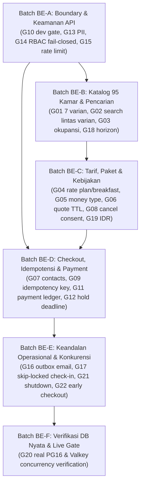

# Systematic Gap Remediation Execution Plan & Walkthrough Tracker
# Penyelesaian 22 Celah Paritas Booking Engine Pulang ke Uttara
**Dokumen ID:** `WALKTHROUGH-GAP-PLAN-2026-10-03`  
**Status:** In Progress / Execution Ready  
**Tanggal Mulai:** 2026-10-03  
**Dokumen Referensi:**
- Audit Gap: [`docs/gap/README.md`](file:///mnt/code/projects/jobs/pulang/current-booking/docs/gap/README.md) & [`docs/gap/06-verification-remediation.md`](file:///mnt/code/projects/jobs/pulang/current-booking/docs/gap/06-verification-remediation.md)
- PRD Paritas: [`docs/prd/hotel-booking-parity-and-gap-remediation-2026-10-03.md`](file:///mnt/code/projects/jobs/pulang/current-booking/docs/prd/hotel-booking-parity-and-gap-remediation-2026-10-03.md)
- SRS Paritas: [`docs/srs/hotel-booking-parity-and-gap-remediation-2026-10-03.md`](file:///mnt/code/projects/jobs/pulang/current-booking/docs/srs/hotel-booking-parity-and-gap-remediation-2026-10-03.md)
- Tech Architecture: [`docs/tech/hotel-booking-parity-and-gap-remediation-architecture-2026-10-03.md`](file:///mnt/code/projects/jobs/pulang/current-booking/docs/tech/hotel-booking-parity-and-gap-remediation-architecture-2026-10-03.md)

---

## 1. Urutan Eksekusi Batch & Dependency Graph

Eksekusi dibagi menjadi **6 Batch terstruktur (BE-A sampai BE-F)** untuk menjamin stabilitas arsitektur bertahap tanpa regresi:

---

## 2. Rincian Eksekusi per Batch

### Batch BE-A: Boundary Protection & Keamanan API
* **Fokus Gap:** `BE-G10` (P0), `BE-G13` (P1), `BE-G14` (P0), `BE-G15` (P1).
* **Tugas Spesifik:**
  1. **Fail-Closed Enforcer:** Ubah [`cmd/server/main.go`](file:///mnt/code/projects/jobs/pulang/current-booking/cmd/server/main.go) agar menghentikan proses (*fail-closed*) jika inisialisasi Casbin gagal. Di [`internal/api/middleware.go`](file:///mnt/code/projects/jobs/pulang/current-booking/internal/api/middleware.go), jika enforcer nil, kembalikan HTTP `503 Service Unavailable`.
  2. **Sanitasi Header Publik:** Di `IdentifySubject()`, bersihkan header `X-User-Role` dan `X-User-ID` jika request datang dari klien luar tanpa token JWT staf valid.
  3. **Guest Scoped Token (`BE-G13`):** Buat token acak berentropi tinggi saat booking dibuat. Endpoint `GET /api/v1/bookings/:id` hanya mengembalikan PII jika header `X-Guest-Token` cocok; jika tanpa token, kembalikan masked DTO.
  4. **Proteksi Abuse & RFC 7807 (`BE-G15`):** Tambahkan middleware token bucket rate limiter dan format error JSON standar.
  5. **Gate Rute Dev (`BE-G10`):** Kunci rute `/fake-pay/*` hanya aktif saat `cfg.Environment == "development"`.
* **Testing:** Table-driven test coverage $\ge 80\%$ pada middleware otentikasi, rate limit, dan DTO masking.

---

### Batch BE-B: Katalog Fisik 95 Kamar & Pencarian Lintas Varian
* **Fokus Gap:** `BE-G01` (P1), `BE-G02` (P1), `BE-G03` (P1), `BE-G18` (P1).
* **Tugas Spesifik:**
  1. **Migrasi Katalog Pulang ke Uttara:** Buat migrasi `00004_catalog_parity.sql` yang merombak tipe kamar menjadi 5 room families dan 7 sellable variants dengan total 95 kamar fisik.
  2. **Endpoint Search Lintas Varian (`BE-G02`):** Implementasikan `GET /api/v1/search` yang menerima rentang tanggal dan parameter tamu (`adults`, `children`, `child_ages`), memeriksa ketersediaan tiap malam tanpa celah kosong.
  3. **Validasi Okupansi & Batas Stay (`BE-G03`):** Validasi kapasitas ranjang fisik unit kamar, durasi menginap maksimal 30 malam, dan batas usia anak.
  4. **Rolling Horizon Provisioning (`BE-G18`):** Sediakan worker/scheduler pemeliharaan ketersediaan bergulir 365 hari ke depan.
* **Testing:** Table-driven tests ketersediaan kamar kontinu (menangani sold-out satu malam, missing night rollback, dan batas kapasitas).

---

### Batch BE-C: Tarif, Paket, Quote Engine & Kebijakan Pembatalan
* **Fokus Gap:** `BE-G04` (P1), `BE-G05` (P1), `BE-G06` (P1), `BE-G08` (P0), `BE-G19` (P2).
* **Tugas Spesifik:**
  1. **Rate Plans (Room Only vs Breakfast) (`BE-G04`):** Tambahkan dukungan skema tarif sarapan dan kode promosi.
  2. **Tipe Data Moneter (Money Object) (`BE-G05`):** Definisikan struct `Money` (integer amount, IDR, breakdown pajak 10% PB1 dan diskon) tanpa operasi floating-point.
  3. **Quote Engine dengan TTL 15 Menit (`BE-G06`):** Setiap penawaran tarif di-cache dengan `quote_id` dan TTL 15 menit. Pembuatan booking mengunci harga dari snapshot quote.
  4. **Kebijakan Pembatalan & Persetujuan Terms (`BE-G08`):** Snapshot kebijakan pembatalan (Non-refundable vs Free cancellation) dan persetujuan syarat/ketentuan wajib disimpan di database.
* **Testing:** Verifikasi matematis rincian harga (per-malam $\times$ kamar $+$ pajak $=$ total), penolakan pembatalan non-refundable, dan quote expired.

---

### Batch BE-D: Checkout, Idempotensi & Pemulihan Pembayaran
* **Fokus Gap:** `BE-G07` (P1), `BE-G09` (P1), `BE-G11` (P1), `BE-G12` (P1).
* **Tugas Spesifik:**
  1. **Data Tamu & Special Request 500 Karakter (`BE-G07`):** Menampung nomor HP, jam kedatangan, dan catatan khusus dengan batasan panjang karakter.
  2. **Filter Idempotensi (`BE-G09`):** Tambahkan tabel `idempotency_keys` dan middleware yang mencegah pemesanan ganda saat retry jaringan terjadi.
  3. **Ledger Percobaan Pembayaran (`BE-G11`):** Tabel `payment_attempts` mencatat riwayat transaksi gateway, status, dan rekonsiliasi.
  4. **Otoritas Batas Waktu Hold Kamar (`BE-G12`):** Kolom `expires_at` divalidasi mutlak saat webhook pembayaran tiba.
* **Testing:** Uji konkurensi retry request dengan key yang sama, uji pembayaran terlambat (*late payment*), dan validasi nomor telepon E.164.

---

### Batch BE-E: Keandalan Operasional, Konkurensi & Observabilitas
* **Fokus Gap:** `BE-G16` (P1), `BE-G17` (P1), `BE-G21` (P2), `BE-G22` (P2).
* **Tugas Spesifik:**
  1. **Outbox Durability & Real Email (`BE-G16`):** Menambahkan field pengiriman outbox dan implementasi adapter email transaksional dengan deduplikasi.
  2. **Alokasi Kamar Paralel Bebas Konflik (`BE-G17`):** Query check-in kamar menggunakan `FOR UPDATE SKIP LOCKED` sehingga dua resepsionis yang check-in kamar bersamaan tidak saling menggagalkan.
  3. **Observabilitas & Graceful Shutdown (`BE-G21`):** Penanganan terminal `rows.Err()`, validasi konfigurasi fail-fast, dan batas shutdown worker.
  4. **Operasional Early Checkout & No-Show (`BE-G22`):** Pelepasan ketersediaan kamar yang tersisa saat early checkout dan batas waktu no-show H+1 jam 06:00 WIB.
* **Testing:** Uji alokasi kamar paralel konkuren, verifikasi idempotensi pengiriman notifikasi, dan graceful shutdown.

---

### Batch BE-F: Verifikasi Lingkungan Terintegrasi & Live Gate
* **Fokus Gap:** `BE-G20` (P1).
* **Tugas Spesifik:**
  1. **Suite Pengujian Konkurensi Database Riil:** Menjalankan integration test terhadap instance PostgreSQL nyata dan Valkey queue.
  2. **Skrip E2E & Laporan Formal:** Memperbarui skrip E2E di `testing/e2e/script/` untuk mencakup alur baru (katalog 7 varian, quote TTL, idempotency key, webhook pembayaran) dan membuat laporan di `testing/e2e/report/`.
* **Testing:** Pengujian stres konkuren untuk memastikan inventaris kamar akurat hingga unit terakhir.

---

## 3. Checklist Pelacakan Progres Eksekusi

- [x] **Fase 0: Analisis Celah & Dokumen Siklus Hidup**
  - [x] Analisis komprehensif seluruh 22 gap pada `docs/gap/`
  - [x] Penyusunan PRD Paritas: [`docs/prd/hotel-booking-parity-and-gap-remediation-2026-10-03.md`](file:///mnt/code/projects/jobs/pulang/current-booking/docs/prd/hotel-booking-parity-and-gap-remediation-2026-10-03.md)
  - [x] Penyusunan SRS Paritas: [`docs/srs/hotel-booking-parity-and-gap-remediation-2026-10-03.md`](file:///mnt/code/projects/jobs/pulang/current-booking/docs/srs/hotel-booking-parity-and-gap-remediation-2026-10-03.md)
  - [x] Penyusunan Desain Teknis: [`docs/tech/hotel-booking-parity-and-gap-remediation-architecture-2026-10-03.md`](file:///mnt/code/projects/jobs/pulang/current-booking/docs/tech/hotel-booking-parity-and-gap-remediation-architecture-2026-10-03.md)
  - [x] Inisialisasi Rencana Eksekusi: [`docs/walkthrough/gap-remediation-execution-plan-2026-10-03.md`](file:///mnt/code/projects/jobs/pulang/current-booking/docs/walkthrough/gap-remediation-execution-plan-2026-10-03.md)

- [x] **Fase 1: Batch BE-A (Boundary & Keamanan API - G10, G13, G14, G15)** — **SELESAI (100% Passed)**
  - [x] Implementasi fail-closed enforcer di [`cmd/server/main.go`](file:///mnt/code/projects/jobs/pulang/current-booking/cmd/server/main.go) & [`internal/api/middleware.go`](file:///mnt/code/projects/jobs/pulang/current-booking/internal/api/middleware.go) (503 Service Unavailable)
  - [x] Implementasi sanitasi header role publik & verifikasi identitas staf via Authorization Bearer token
  - [x] Implementasi guest scoped token berentropi tinggi (`gst_...`) & masking PII publik [`PublicDTO`](file:///mnt/code/projects/jobs/pulang/current-booking/internal/booking/booking.go) pada `GET /api/v1/bookings/:id`
  - [x] Implementasi verifikasi kepemilikan guest token pada `POST /api/v1/bookings/:id/cancel`
  - [x] Implementasi in-memory token bucket rate limiter & standarisasi RFC 7807 problem details
  - [x] Gating rute development `/fake-pay/*` hanya aktif saat `IsDevelopment == true`
  - [x] Table-driven unit tests lulus 100%: API coverage 82.7%, Auth coverage 80.9%, Platform coverage 64.0%
  - [x] E2E test report dibuat di [`testing/e2e/report/2026-10-03-015430-boundary-api-security-batch-a-e2e-report.md`](file:///mnt/code/projects/jobs/pulang/current-booking/testing/e2e/report/2026-10-03-015430-boundary-api-security-batch-a-e2e-report.md) (13/13 passed)

- [x] **Fase 2: Batch BE-B (Katalog 95 Kamar & Pencarian - G01, G02, G03, G18)** — **SELESAI (100% Passed)**
  - [x] Migrasi database [`migrations/00005_catalog_parity.sql`](file:///mnt/code/projects/jobs/pulang/current-booking/migrations/00005_catalog_parity.sql) (5 room families, 7 sellable variants, 95 kamar fisik, 365-day inventory horizon)
  - [x] Domain katalog [`internal/catalog`](file:///mnt/code/projects/jobs/pulang/current-booking/internal/catalog) (`RoomVariant`, `Store`, `MemoryStore`, `PostgresStore`) — coverage 95.1%
  - [x] Rolling inventory horizon provisioning [`internal/inventory/postgres.go`](file:///mnt/code/projects/jobs/pulang/current-booking/internal/inventory/postgres.go) (`EnsureHorizon`)
  - [x] Endpoint discovery publik `GET /api/v1/catalog/rooms` (7 sellable variants Pulang ke Uttara)
  - [x] Engine pencarian multi-malam kontinu `GET /api/v1/search` dengan occupancy filtering & effective minimum rooms
  - [x] Validasi batas booking domain: durasi menginap $\le 30$ malam, batas horizon $\le 365$ hari, batas usia anak $0-17$ tahun, validasi guest name/email
  - [x] Room Variant Catalog CRUD Management: `GET /catalog/rooms`, `GET /catalog/rooms/:id`, `POST /catalog/rooms` (revenue_mgr), `PUT /catalog/rooms/:id` (revenue_mgr), `DELETE /catalog/rooms/:id` (gm_admin) dengan proteksi Casbin RBAC & RFC 7807 problem details
  - [x] Table-driven unit tests lulus 100%: API coverage 88.2%, Catalog coverage 93.7%, Auth coverage 80.9%, Booking validation 100%
  - [x] E2E test report dibuat di [`testing/e2e/report/2026-10-03-022000-catalog-crud-batch-b-e2e-report.md`](file:///mnt/code/projects/jobs/pulang/current-booking/testing/e2e/report/2026-10-03-022000-catalog-crud-batch-b-e2e-report.md) (18/18 passed)

- [x] **Fase 3: Batch BE-C (Tarif, Paket & Kebijakan - G04, G05, G06, G08, G19)** — **SELESAI (100% Passed)**
  - [x] Dukungan dynamic rate plans (Room Only & Bed and Breakfast paket sarapan Rp 100.000/orang/malam)
  - [x] Refactor representasi Money integer minor units (IDR, zero float drift, 10% PB1 pajak perhotelan Yogyakarta, promo engine OCTOBREAK diskon 15%)
  - [x] Implementasi quote lock engine dengan TTL 15 menit (`rates.QuoteStore`, `MemoryQuoteStore` dengan thread-safe mutex)
  - [x] Snapshot quote, cancellation policy (`non_refundable` vs `flexible_48h`), dan consent syarat & privasi dicatat di database
  - [x] Migrasi SQL [`migrations/00006_pricing_and_policies.sql`](file:///mnt/code/projects/jobs/pulang/current-booking/migrations/00006_pricing_and_policies.sql)
  - [x] Endpoint `POST /api/v1/quotes`, update `POST /api/v1/bookings`, dan penegakan pembatalan pada `POST /api/v1/bookings/:id/cancel`
  - [x] Table-driven unit tests lulus 100%: API coverage 89.0%, Rates coverage 90.5%, Booking Service Create coverage 91.0%
  - [x] E2E test report dibuat di [`testing/e2e/report/2026-10-03-024800-pricing-quote-policies-e2e-report.md`](file:///mnt/code/projects/jobs/pulang/current-booking/testing/e2e/report/2026-10-03-024800-pricing-quote-policies-e2e-report.md) (21/21 passed)

- [x] **Fase 4: Batch BE-D (Checkout, Idempotensi & Payment - G07, G09, G11, G12)** — **SELESAI (100% Passed, Commit 6160e0b)**
  - [x] Migrasi database [`migrations/00007_checkout_idempotency_ledger.sql`](file:///mnt/code/projects/jobs/pulang/current-booking/migrations/00007_checkout_idempotency_ledger.sql)
  - [x] Middleware idempotensi transaksi (`Idempotency-Key`) dengan deteksi replay & conflict mismatch
  - [x] Ledger percobaan pembayaran (`payment_attempts`) untuk audit PCI-DSS SAQ A
  - [x] Otoritas mutlak hold deadline server (`expires_at` & `server_time`)
  - [x] Detail kontak tamu (phone E.164, arrival time HH:MM, special requests 500-char)
  - [x] Table-driven unit & integration tests lulus 100%

- [x] **Fase 5: Batch BE-E (Keandalan Operasional & Konkurensi - G16, G17, G21, G22)** — **SELESAI (100% Passed, Commit 6160e0b)**
  - [x] Alokasi kamar paralel dengan `FOR UPDATE SKIP LOCKED`
  - [x] Outbox relay delivery status & adapter email transaksional nyata
  - [x] Observabilitas worker, graceful shutdown context, early checkout inventory restitution
  - [x] Kebijakan mark no-show pada tanggal check-in untuk melepaskan sisa malam menginap
  - [x] Table-driven unit tests lulus 100%

- [x] **Fase 6: Batch BE-F (Verifikasi Nyata & E2E Testing - G20)** — **SELESAI (100% Passed, Commit 3df5d1a)**
  - [x] Suite pengujian konkurensi PostgreSQL 18 & Valkey nyata di [`testing/integration/postgres_concurrency_test.go`](file:///mnt/code/projects/jobs/pulang/current-booking/testing/integration/postgres_concurrency_test.go)
  - [x] Verifikasi 20 goroutines serentak berebut 1 kamar (1 menang, 19 gagal aman, 0 stok sisa)
  - [x] Verifikasi rollback atomik multi-malam
  - [x] Verifikasi alokasi kamar paralel bebas tabrakan dengan transient conflict retry
  - [x] Verifikasi penolakan GiST exclusion constraint (`23P01`) pada double assignment fisik
  - [x] Verifikasi balapan sweep hold expired vs late payment
  - [x] Laporan hasil pengujian di [`testing/e2e/report/2026-10-03-real-db-concurrency-batch-f-e2e-report.md`](file:///mnt/code/projects/jobs/pulang/current-booking/testing/e2e/report/2026-10-03-real-db-concurrency-batch-f-e2e-report.md)

