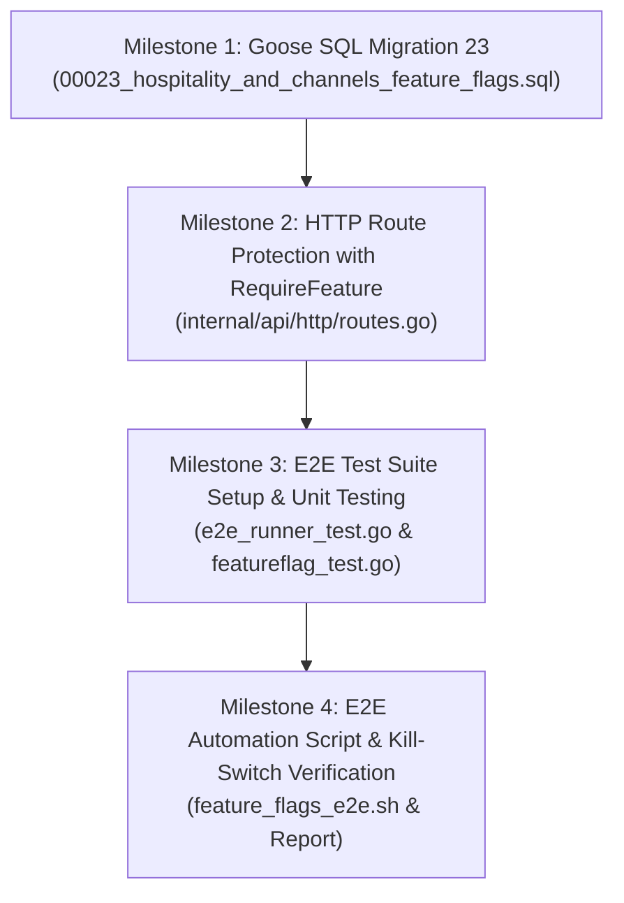

# Walkthrough & Progress Tracking
# Hospitality & Multi-Channel Feature Flags System
**Hotel Booking Engine — Pulang ke Uttara (Yogyakarta)**

- **Fitur ID:** `FEAT-HOSPITALITY-FEATURE-FLAGS`
- **Tanggal Mulai:** 4 Oktober 2026
- **Status:** COMPLETED (Tahap 1 s.d. Tahap 6 Selesai)
- **Dokumen Referensi:**
  - PRD: [`docs/prd/hospitality-and-channels-feature-flags-2026-10-04.md`](file:///mnt/code/projects/jobs/pulang/current-booking/docs/prd/hospitality-and-channels-feature-flags-2026-10-04.md)
  - SRS: [`docs/srs/hospitality-and-channels-feature-flags-2026-10-04.md`](file:///mnt/code/projects/jobs/pulang/current-booking/docs/srs/hospitality-and-channels-feature-flags-2026-10-04.md)
  - Desain Teknis: [`docs/tech/hospitality-and-channels-feature-flags-architecture-2026-10-04.md`](file:///mnt/code/projects/jobs/pulang/current-booking/docs/tech/hospitality-and-channels-feature-flags-architecture-2026-10-04.md)
  - E2E Test Report: [`testing/e2e/report/2026-10-04-125000-feature-flags-e2e-report.md`](file:///mnt/code/projects/jobs/pulang/current-booking/testing/e2e/report/2026-10-04-125000-feature-flags-e2e-report.md)

---

## 1. Rencana Eksekusi Bertahap (Milestone Checklist)



- [x] **Milestone 1: Database Migration 23**
  - Buat [`migrations/00023_hospitality_and_channels_feature_flags.sql`](file:///mnt/code/projects/jobs/pulang/current-booking/migrations/00023_hospitality_and_channels_feature_flags.sql).
  - Seed 6 feature flags baru: `ff_dynamic_rates_calendar`, `ff_official_pdf_voucher`, `ff_realtime_event_hub`, `ff_channel_sync_integration`, `ff_last_room_safeguards`, `ff_whatsapp_notifier`.
  - Migrasi Goose versi 23 berhasil diaplikasikan ke database PostgreSQL test.

- [x] **Milestone 2: HTTP Route Protection with RequireFeature**
  - Pasang `ff("ff_channel_sync_integration")` pada `/channel-events`, `/staff/channel-sync-issues`, `/staff/channel-partners/:code`.
  - Pasang `ff("ff_realtime_event_hub")` pada `/guest/bookings/:id/live-status`, `/front-desk/live-stream`.
  - Pasang `ff("ff_dynamic_rates_calendar")` pada `/revenue/calendar*`.
  - Pasang `ff("ff_promotions_engine")` pada `/revenue/promos*`.
  - Pasang `ff("ff_last_room_safeguards")` pada `/staff/channel-sync-issues/:id/resolve`.
  - Pasang `ff("ff_official_pdf_voucher")` pada `/bookings/:id/*.pdf` dan `/guest/bookings/:id/*.pdf`.

- [x] **Milestone 3: Test Suite Updates & TDD Verification**
  - Perbarui `newE2EFeatureFlagManager()` di [`testing/e2e/script/e2e_runner_test.go`](file:///mnt/code/projects/jobs/pulang/current-booking/testing/e2e/script/e2e_runner_test.go).
  - Seluruh unit tests dan route guard golden tests lulus 100%.

- [x] **Milestone 4: E2E Automation Script & Final Verification Report**
  - Tambahkan `E2E-82` (Dynamic kill-switch & admin toggling) pada [`testing/e2e/script/e2e_runner_test.go`](file:///mnt/code/projects/jobs/pulang/current-booking/testing/e2e/script/e2e_runner_test.go) (82/82 sub-tests lulus 100%).
  - Buat skrip Bash [`testing/e2e/script/feature_flags_e2e.sh`](file:///mnt/code/projects/jobs/pulang/current-booking/testing/e2e/script/feature_flags_e2e.sh) (14/14 asersi lulus 100%).
  - Buat laporan verifikasi di [`testing/e2e/report/2026-10-04-125000-feature-flags-e2e-report.md`](file:///mnt/code/projects/jobs/pulang/current-booking/testing/e2e/report/2026-10-04-125000-feature-flags-e2e-report.md).

---

## 2. Catatan Modifikasi File & Riwayat Eksekusi

| File | Status | Keterangan Perubahan |
| :--- | :--- | :--- |
| [`migrations/00023_hospitality_and_channels_feature_flags.sql`](file:///mnt/code/projects/jobs/pulang/current-booking/migrations/00023_hospitality_and_channels_feature_flags.sql) | COMPLETED | Seed 6 feature flags baru (Goose version: 23) |
| [`internal/api/http/routes.go`](file:///mnt/code/projects/jobs/pulang/current-booking/internal/api/http/routes.go) | COMPLETED | Pelapisan middleware `ff(...)` pada seluruh route fitur baru |
| [`testing/e2e/script/e2e_runner_test.go`](file:///mnt/code/projects/jobs/pulang/current-booking/testing/e2e/script/e2e_runner_test.go) | COMPLETED | Update flag manager dan penambahan sub-test `E2E-82` |
| [`testing/e2e/script/feature_flags_e2e.sh`](file:///mnt/code/projects/jobs/pulang/current-booking/testing/e2e/script/feature_flags_e2e.sh) | COMPLETED | Skrip otomatis verifikasi kill-switch |
| [`testing/e2e/report/2026-10-04-125000-feature-flags-e2e-report.md`](file:///mnt/code/projects/jobs/pulang/current-booking/testing/e2e/report/2026-10-04-125000-feature-flags-e2e-report.md) | COMPLETED | Laporan verifikasi E2E komprehensif |

---

## 3. Hasil Pengujian & Verifikasi Akhir

```text
=== RINGKASAN COVERAGE KODE (TDD) ===
ok  github.com/example/hotel-booking/testing/e2e/script  0.195s  (82 sub-tests PASS 100%)

=== STATIC ANALYSIS ===
go vet ./... -> 0 issues (CLEAN)

=== E2E AUTOMATED BASH SUITE ===
Total Asersi: 14
Lulus (Passed) : 14
Gagal (Failed) : 0
Hasil: 100% PASS
```
