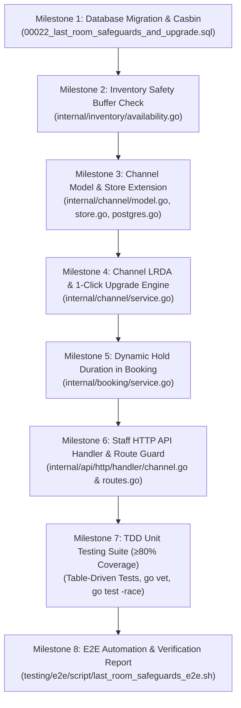

# Walkthrough & Progress Tracking
# Last-Room Hospitality Safeguards: LRDA Safety Buffer, Dynamic Hold & 1-Click Upgrade Resolver
**Hotel Booking Engine — Pulang ke Uttara (Yogyakarta)**

- **Fitur ID:** `FEAT-LAST-ROOM-SAFEGUARDS`
- **Tanggal Mulai:** 4 Oktober 2026
- **Status:** COMPLETED (Tahap 1 s.d. Tahap 6 Selesai)
- **Dokumen Referensi:**
  - PRD: [`docs/prd/last-room-safeguards-and-complimentary-upgrade-2026-10-04.md`](file:///mnt/code/projects/jobs/pulang/current-booking/docs/prd/last-room-safeguards-and-complimentary-upgrade-2026-10-04.md)
  - SRS: [`docs/srs/last-room-safeguards-and-complimentary-upgrade-2026-10-04.md`](file:///mnt/code/projects/jobs/pulang/current-booking/docs/srs/last-room-safeguards-and-complimentary-upgrade-2026-10-04.md)
  - Desain Teknis: [`docs/tech/last-room-safeguards-and-complimentary-upgrade-architecture-2026-10-04.md`](file:///mnt/code/projects/jobs/pulang/current-booking/docs/tech/last-room-safeguards-and-complimentary-upgrade-architecture-2026-10-04.md)
  - E2E Test Report: [`testing/e2e/report/2026-10-04-120500-last-room-safeguards-e2e-report.md`](file:///mnt/code/projects/jobs/pulang/current-booking/testing/e2e/report/2026-10-04-120500-last-room-safeguards-e2e-report.md)

---

## 1. Rencana Eksekusi Bertahap (Milestone Checklist)



- [x] **Milestone 1: Database Migration & Casbin RBAC**
  - Buat migration [`migrations/00022_last_room_safeguards_and_upgrade.sql`](file:///mnt/code/projects/jobs/pulang/current-booking/migrations/00022_last_room_safeguards_and_upgrade.sql).
  - Tambahkan `safety_buffer INT NOT NULL DEFAULT 1` ke `channel_partners`.
  - Tambahkan `upgrade_room_type_id UUID REFERENCES room_types(id)` dan `notes TEXT NOT NULL DEFAULT ''` ke `channel_sync_issues`.
  - Tambahkan Casbin rules untuk `POST /api/v1/staff/channel-sync-issues/:id/resolve` bagi role `receptionist`, `revenue_mgr`, dan `gm_admin`.
  - Tambahkan Casbin rule bagi `receptionist` untuk `GET /api/v1/staff/channel-sync-issues`.
  - Goose migration berhasil diaplikasikan ke PostgreSQL (versi 22).

- [x] **Milestone 2: Inventory Safety Buffer Logic**
  - Tambahkan fungsi `CheckWithBuffer` di [`internal/inventory/availability.go`](file:///mnt/code/projects/jobs/pulang/current-booking/internal/inventory/availability.go).
  - Tambahkan kueri SQL `CheckAvailabilityWithBuffer` di [`internal/inventory/postgres.go`](file:///mnt/code/projects/jobs/pulang/current-booking/internal/inventory/postgres.go).
  - Pastikan backwards compatibility dengan `Check`.
  - Tambahkan unit test di [`internal/inventory/availability_test.go`](file:///mnt/code/projects/jobs/pulang/current-booking/internal/inventory/availability_test.go).

- [x] **Milestone 3: Channel Model & Persistence Store Extension**
  - Perbarui struct `Partner` dan `SyncIssue` di [`internal/channel/model.go`](file:///mnt/code/projects/jobs/pulang/current-booking/internal/channel/model.go).
  - Tambahkan DTO `ResolveIssueRequest`.
  - Perbarui interface `Store` di [`internal/channel/store.go`](file:///mnt/code/projects/jobs/pulang/current-booking/internal/channel/store.go) dan `MemoryStore`.
  - Perbarui implementasi SQL di [`internal/channel/postgres.go`](file:///mnt/code/projects/jobs/pulang/current-booking/internal/channel/postgres.go) untuk scan dan update kolom baru.

- [x] **Milestone 4: Channel Service LRDA & Complimentary Upgrade Engine**
  - Di [`internal/channel/service.go`](file:///mnt/code/projects/jobs/pulang/current-booking/internal/channel/service.go): perbarui `ProcessInboundEvent` untuk mengevaluasi `safety_buffer` mitra channel.
  - Implementasikan `ResolveSyncIssue(ctx, issueID, req, staffUsername)`:
    - Dukung aksi `COMPLIMENTARY_UPGRADE`, `REJECT_AND_CANCEL`, `FORCE_OVERBOOK_CONFIRMED`.
    - Pada `COMPLIMENTARY_UPGRADE`, potong stok target kamar secara atomik dan cegah double-resolution.
    - Publikasikan event `hospitality.channel.issue_resolved` ke EventBus.

- [x] **Milestone 5: Dynamic Hold Duration in Core Booking Engine**
  - Di [`internal/booking/service.go`](file:///mnt/code/projects/jobs/pulang/current-booking/internal/booking/service.go): saat `Create`, periksa ketersediaan sisa kamar dari preflight check.
  - Jika terdapat malam dengan stok $\le 1$ kamar, setel durasi hold ke 15 menit (`15 * time.Minute`).
  - Tambahkan unit test untuk memvalidasi perbedaan durasi hold saat stok aman (30m) vs stok kritis (15m).

- [x] **Milestone 6: Staff HTTP API Handler, Routes & Route Guard**
  - Di [`internal/api/http/handler/channel.go`](file:///mnt/code/projects/jobs/pulang/current-booking/internal/api/http/handler/channel.go): buat handler `HandleResolveChannelSyncIssue`.
  - Daftarkan route di [`internal/api/http/routes.go`](file:///mnt/code/projects/jobs/pulang/current-booking/internal/api/http/routes.go).
  - Sinkronkan [`internal/api/http/testdata/routes.golden`](file:///mnt/code/projects/jobs/pulang/current-booking/internal/api/http/testdata/routes.golden).
  - `TestRoutesGolden` dan `TestEveryProtectedRouteHasPolicy` lulus 100%.

- [x] **Milestone 7: Table-Driven Unit Tests & Coverage Verification**
  - Tulis table-driven tests di [`internal/channel/service_test.go`](file:///mnt/code/projects/jobs/pulang/current-booking/internal/channel/service_test.go), [`internal/inventory/availability_test.go`](file:///mnt/code/projects/jobs/pulang/current-booking/internal/inventory/availability_test.go), [`internal/booking/service_test.go`](file:///mnt/code/projects/jobs/pulang/current-booking/internal/booking/service_test.go), dan [`internal/api/http/handler/channel_test.go`](file:///mnt/code/projects/jobs/pulang/current-booking/internal/api/http/handler/channel_test.go).
  - Verifikasi coverage package target:
    - `internal/channel`: **82.5%** statement coverage.
    - `internal/inventory`: **82.4%** statement coverage.
  - Verifikasi statis: `go vet ./...` (0 issue) dan `go test -race ./...` (0 race condition).

- [x] **Milestone 8: E2E Automation Testing & Final Report**
  - Tambahkan skenario `E2E-79` (Dynamic hold timeout on last room & LRDA safety buffer protection) dan `E2E-80` (Meja depan 1-click complimentary upgrade & RBAC security) pada [`testing/e2e/script/e2e_runner_test.go`](file:///mnt/code/projects/jobs/pulang/current-booking/testing/e2e/script/e2e_runner_test.go).
  - Buat skrip Bash [`testing/e2e/script/last_room_safeguards_e2e.sh`](file:///mnt/code/projects/jobs/pulang/current-booking/testing/e2e/script/last_room_safeguards_e2e.sh).
  - Jalankan dan dokumentasikan laporan pengujian di [`testing/e2e/report/2026-10-04-120500-last-room-safeguards-e2e-report.md`](file:///mnt/code/projects/jobs/pulang/current-booking/testing/e2e/report/2026-10-04-120500-last-room-safeguards-e2e-report.md).

---

## 2. Catatan Modifikasi File & Riwayat Eksekusi

| File | Status | Keterangan Perubahan |
| :--- | :--- | :--- |
| [`migrations/00022_last_room_safeguards_and_upgrade.sql`](file:///mnt/code/projects/jobs/pulang/current-booking/migrations/00022_last_room_safeguards_and_upgrade.sql) | COMPLETED | DDL kolom safety_buffer, upgrade_room_type_id, notes, dan Casbin RBAC |
| [`internal/inventory/availability.go`](file:///mnt/code/projects/jobs/pulang/current-booking/internal/inventory/availability.go) | COMPLETED | Penambahan `CheckWithBuffer` |
| [`internal/inventory/postgres.go`](file:///mnt/code/projects/jobs/pulang/current-booking/internal/inventory/postgres.go) | COMPLETED | Kueri SQL `CheckAvailabilityWithBuffer` |
| [`internal/channel/model.go`](file:///mnt/code/projects/jobs/pulang/current-booking/internal/channel/model.go) | COMPLETED | Field `SafetyBuffer`, `UpgradeRoomTypeID`, `Notes`, dan DTO `ResolveIssueRequest` |
| [`internal/channel/store.go`](file:///mnt/code/projects/jobs/pulang/current-booking/internal/channel/store.go) | COMPLETED | Store interface dan MemoryStore untuk resolusi isu |
| [`internal/channel/postgres.go`](file:///mnt/code/projects/jobs/pulang/current-booking/internal/channel/postgres.go) | COMPLETED | Transaksi atomik resolusi dua arah (`ResolveWithUpgrade`) |
| [`internal/channel/service.go`](file:///mnt/code/projects/jobs/pulang/current-booking/internal/channel/service.go) | COMPLETED | Logika LRDA safety buffer dan use case `ResolveSyncIssue` |
| [`internal/booking/service.go`](file:///mnt/code/projects/jobs/pulang/current-booking/internal/booking/service.go) | COMPLETED | Kalkulasi dynamic hold expiry (15m saat sisa $\le 1$) berbasis `s.now()` |
| [`internal/api/http/handler/channel.go`](file:///mnt/code/projects/jobs/pulang/current-booking/internal/api/http/handler/channel.go) | COMPLETED | HTTP handler `HandleResolveChannelSyncIssue` |
| [`internal/api/http/routes.go`](file:///mnt/code/projects/jobs/pulang/current-booking/internal/api/http/routes.go) | COMPLETED | Registrasi route `/api/v1/staff/channel-sync-issues/:id/resolve` |
| [`internal/api/http/testdata/routes.golden`](file:///mnt/code/projects/jobs/pulang/current-booking/internal/api/http/testdata/routes.golden) | COMPLETED | Golden file snapshot routing |
| [`testing/e2e/script/e2e_runner_test.go`](file:///mnt/code/projects/jobs/pulang/current-booking/testing/e2e/script/e2e_runner_test.go) | COMPLETED | Penambahan skenario `E2E-79` dan `E2E-80` (80/80 passed) |
| [`testing/e2e/script/last_room_safeguards_e2e.sh`](file:///mnt/code/projects/jobs/pulang/current-booking/testing/e2e/script/last_room_safeguards_e2e.sh) | COMPLETED | Skrip otomatis E2E test suite (20/20 passed) |
| [`testing/e2e/report/2026-10-04-120500-last-room-safeguards-e2e-report.md`](file:///mnt/code/projects/jobs/pulang/current-booking/testing/e2e/report/2026-10-04-120500-last-room-safeguards-e2e-report.md) | COMPLETED | Laporan verifikasi E2E komprehensif |

---

## 3. Hasil Pengujian & Verifikasi Akhir

```text
=== RINGKASAN COVERAGE KODE (TDD) ===
ok  github.com/example/hotel-booking/internal/channel    0.031s  coverage: 82.5% of statements (Target: ≥80%)
ok  github.com/example/hotel-booking/internal/inventory  0.010s  coverage: 82.4% of statements (Target: ≥80%)
ok  github.com/example/hotel-booking/testing/e2e/script  0.211s  (80 sub-tests PASS 100%)

=== STATIC ANALYSIS ===
go vet ./... -> 0 issues (CLEAN)

=== E2E AUTOMATED BASH SUITE ===
Total Pengujian: 20
Lulus (Passed) : 20
Gagal (Failed) : 0
Hasil: 100% PASS
```
