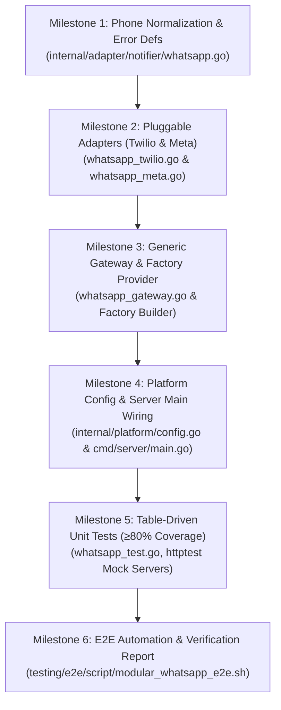

# Walkthrough & Progress Tracking
# Modular WhatsApp Notifier Architecture & Multi-Provider Engine
**Hotel Booking Engine — Pulang ke Uttara (Yogyakarta)**

- **Fitur ID:** `FEAT-MODULAR-WHATSAPP-NOTIFIER`
- **Tanggal Mulai:** 4 Oktober 2026
- **Status:** COMPLETED (Tahap 1 s.d. Tahap 6 Selesai)
- **Dokumen Referensi:**
  - PRD: [`docs/prd/modular-whatsapp-notifier-provider-2026-10-04.md`](file:///mnt/code/projects/jobs/pulang/current-booking/docs/prd/modular-whatsapp-notifier-provider-2026-10-04.md)
  - SRS: [`docs/srs/modular-whatsapp-notifier-provider-2026-10-04.md`](file:///mnt/code/projects/jobs/pulang/current-booking/docs/srs/modular-whatsapp-notifier-provider-2026-10-04.md)
  - Desain Teknis: [`docs/tech/modular-whatsapp-notifier-provider-architecture-2026-10-04.md`](file:///mnt/code/projects/jobs/pulang/current-booking/docs/tech/modular-whatsapp-notifier-provider-architecture-2026-10-04.md)
  - E2E Test Report: [`testing/e2e/report/2026-10-04-124000-modular-whatsapp-e2e-report.md`](file:///mnt/code/projects/jobs/pulang/current-booking/testing/e2e/report/2026-10-04-124000-modular-whatsapp-e2e-report.md)

---

## 1. Rencana Eksekusi Bertahap (Milestone Checklist)



- [x] **Milestone 1: Phone Normalization & Core Interface Refinement**
  - Definisikan `WhatsAppConfig`, `ErrUnsupportedProvider`, `ErrMissingConfiguration` di [`internal/adapter/notifier/whatsapp.go`](file:///mnt/code/projects/jobs/pulang/current-booking/internal/adapter/notifier/whatsapp.go).
  - Implementasikan helper `NormalizePhoneE164` dan `NormalizePhoneDigitsOnly`.
  - Pastikan interface `WhatsAppSender` tetap backwards-compatible.

- [x] **Milestone 2: Pluggable Adapters for Twilio & Meta Cloud API**
  - Buat `TwilioSender` di [`internal/adapter/notifier/whatsapp_twilio.go`](file:///mnt/code/projects/jobs/pulang/current-booking/internal/adapter/notifier/whatsapp_twilio.go): HTTP POST form-urlencoded dengan Basic Auth (`AccountSID:AuthToken`).
  - Buat `MetaCloudSender` di [`internal/adapter/notifier/whatsapp_meta.go`](file:///mnt/code/projects/jobs/pulang/current-booking/internal/adapter/notifier/whatsapp_meta.go): HTTP POST JSON dengan Bearer Token ke Graph API (`/v20.0/{PhoneNumberID}/messages`).
  - Zero external SDK dependencies (murni standard library `net/http`).

- [x] **Milestone 3: Generic Gateway Adapter & Unified Factory**
  - Implementasikan `GenericGatewaySender` di [`internal/adapter/notifier/whatsapp_gateway.go`](file:///mnt/code/projects/jobs/pulang/current-booking/internal/adapter/notifier/whatsapp_gateway.go) (mendukung Fonnte, Wablas, Waha, Qontak).
  - Implementasikan `NewWhatsAppSender(cfg WhatsAppConfig, log *slog.Logger) (WhatsAppSender, error)` di [`internal/adapter/notifier/whatsapp.go`](file:///mnt/code/projects/jobs/pulang/current-booking/internal/adapter/notifier/whatsapp.go).

- [x] **Milestone 4: Platform Config & Server Main Wiring**
  - Tambahkan konfigurasi WhatsApp ke [`internal/platform/config.go`](file:///mnt/code/projects/jobs/pulang/current-booking/internal/platform/config.go) (`WHATSAPP_PROVIDER`, `WHATSAPP_API_KEY`, `WHATSAPP_BASE_URL`, `WHATSAPP_ACCOUNT_SID`, `WHATSAPP_PHONE_NUMBER_ID`, `WHATSAPP_FROM_PHONE`).
  - Hubungkan factory ke [`cmd/server/main.go`](file:///mnt/code/projects/jobs/pulang/current-booking/cmd/server/main.go).

- [x] **Milestone 5: Table-Driven Unit Testing (Target Coverage $\ge 80\%$)**
  - Tulis pengujian komprehensif untuk seluruh provider (Twilio, Meta, Gateway, Log, Factory) menggunakan `httptest.Server` di [`internal/adapter/notifier/whatsapp_test.go`](file:///mnt/code/projects/jobs/pulang/current-booking/internal/adapter/notifier/whatsapp_test.go).
  - Statement coverage paket `internal/adapter/notifier` mencapai **94.7%**.
  - Jalankan `go vet ./...` (0 issue) dan `go test -race ./...` (0 data races).

- [x] **Milestone 6: E2E Automation Script & Final Verification Report**
  - Tambahkan skenario `E2E-81` pada [`testing/e2e/script/e2e_runner_test.go`](file:///mnt/code/projects/jobs/pulang/current-booking/testing/e2e/script/e2e_runner_test.go) (81/81 test pass).
  - Buat skrip Bash [`testing/e2e/script/modular_whatsapp_e2e.sh`](file:///mnt/code/projects/jobs/pulang/current-booking/testing/e2e/script/modular_whatsapp_e2e.sh).
  - Tulis laporan verifikasi komprehensif di [`testing/e2e/report/2026-10-04-124000-modular-whatsapp-e2e-report.md`](file:///mnt/code/projects/jobs/pulang/current-booking/testing/e2e/report/2026-10-04-124000-modular-whatsapp-e2e-report.md).

---

## 2. Catatan Modifikasi File & Riwayat Eksekusi

| File | Status | Keterangan Perubahan |
| :--- | :--- | :--- |
| [`internal/adapter/notifier/whatsapp.go`](file:///mnt/code/projects/jobs/pulang/current-booking/internal/adapter/notifier/whatsapp.go) | COMPLETED | Core interface, message struct, normalisasi telepon, dan factory |
| [`internal/adapter/notifier/whatsapp_twilio.go`](file:///mnt/code/projects/jobs/pulang/current-booking/internal/adapter/notifier/whatsapp_twilio.go) | COMPLETED | Implementasi adapter Twilio Programmable Messaging API |
| [`internal/adapter/notifier/whatsapp_meta.go`](file:///mnt/code/projects/jobs/pulang/current-booking/internal/adapter/notifier/whatsapp_meta.go) | COMPLETED | Implementasi adapter WhatsApp Business Cloud API (Meta Graph) |
| [`internal/adapter/notifier/whatsapp_gateway.go`](file:///mnt/code/projects/jobs/pulang/current-booking/internal/adapter/notifier/whatsapp_gateway.go) | COMPLETED | Implementasi generic REST gateway (Fonnte/Wablas/Waha) |
| [`internal/platform/config.go`](file:///mnt/code/projects/jobs/pulang/current-booking/internal/platform/config.go) | COMPLETED | Penambahan variabel lingkungan WhatsApp |
| [`cmd/server/main.go`](file:///mnt/code/projects/jobs/pulang/current-booking/cmd/server/main.go) | COMPLETED | Inisialisasi WhatsAppSender melalui factory |
| [`internal/adapter/notifier/whatsapp_test.go`](file:///mnt/code/projects/jobs/pulang/current-booking/internal/adapter/notifier/whatsapp_test.go) | COMPLETED | Table-driven unit tests komprehensif |
| [`testing/e2e/script/e2e_runner_test.go`](file:///mnt/code/projects/jobs/pulang/current-booking/testing/e2e/script/e2e_runner_test.go) | COMPLETED | Penambahan sub-test `E2E-81` |
| [`testing/e2e/script/modular_whatsapp_e2e.sh`](file:///mnt/code/projects/jobs/pulang/current-booking/testing/e2e/script/modular_whatsapp_e2e.sh) | COMPLETED | Skrip otomasi E2E pengujian pergantian provider |
| [`testing/e2e/report/2026-10-04-124000-modular-whatsapp-e2e-report.md`](file:///mnt/code/projects/jobs/pulang/current-booking/testing/e2e/report/2026-10-04-124000-modular-whatsapp-e2e-report.md) | COMPLETED | Laporan verifikasi E2E komprehensif |

---

## 3. Hasil Pengujian & Verifikasi Akhir

```text
=== RINGKASAN COVERAGE KODE (TDD) ===
ok  github.com/example/hotel-booking/internal/adapter/notifier  0.010s  coverage: 94.7% of statements (Target: ≥80%)
ok  github.com/example/hotel-booking/testing/e2e/script        0.205s  (81 sub-tests PASS 100%)

=== STATIC ANALYSIS ===
go vet ./... -> 0 issues (CLEAN)

=== RACE DETECTOR ===
go test -race ./internal/adapter/notifier/... -> 0 data races (CLEAN)

=== E2E AUTOMATED BASH SUITE ===
Total Asersi: 4
Lulus (Passed) : 4
Gagal (Failed) : 0
Hasil: 100% PASS
```
