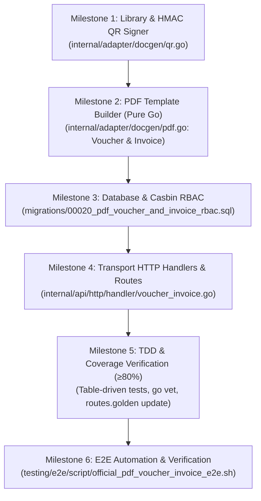

# Walkthrough & Progress Tracking
# Candidate B: Official PDF Confirmation Voucher & PBJT Tax Invoice Engine
**Hotel Booking Engine — Pulang ke Uttara (Yogyakarta)**

- **Fitur ID:** `FEAT-CANDIDATE-B-PDF-VOUCHER-INVOICE`
- **Tanggal Mulai:** 4 Oktober 2026
- **Status:** COMPLETED (Tahap 1 - 6)
- **Dokumen Referensi:**
  - PRD: [`docs/prd/official-pdf-voucher-and-tax-invoice-2026-10-04.md`](file:///mnt/code/projects/jobs/pulang/current-booking/docs/prd/official-pdf-voucher-and-tax-invoice-2026-10-04.md)
  - SRS: [`docs/srs/official-pdf-voucher-and-tax-invoice-2026-10-04.md`](file:///mnt/code/projects/jobs/pulang/current-booking/docs/srs/official-pdf-voucher-and-tax-invoice-2026-10-04.md)
  - Desain Teknis: [`docs/tech/official-pdf-voucher-and-tax-invoice-architecture-2026-10-04.md`](file:///mnt/code/projects/jobs/pulang/current-booking/docs/tech/official-pdf-voucher-and-tax-invoice-architecture-2026-10-04.md)
  - E2E Test Report: [`testing/e2e/report/2026-10-04-053500-official-pdf-voucher-and-tax-invoice-e2e-report.md`](file:///mnt/code/projects/jobs/pulang/current-booking/testing/e2e/report/2026-10-04-053500-official-pdf-voucher-and-tax-invoice-e2e-report.md)

---

## 1. Rencana Eksekusi Bertahap (Milestone Checklist)



- [x] **Milestone 1: Library & HMAC QR Signer (`internal/adapter/docgen/qr.go`)**
  - Pasang dependensi pure-Go `maroto/v2` dan `go-qrcode` (zero CGO, zero system utilities).
  - Implementasikan token signer dan verifier HMAC-SHA256 untuk verifikasi cepat meja depan (`GenerateQRVerificationToken`, `VerifyQRToken`, `GenerateQRCodePNG`).
- [x] **Milestone 2: PDF Template Builder (`internal/adapter/docgen/pdf.go`)**
  - Implementasikan `GenerateVoucherPDF` (A4, Header Pulang ke Uttara, Detail Tamu & Inap, Embed QR PNG).
  - Implementasikan `GenerateInvoicePDF` (Formulasi PBJT Sleman 10% & Service Charge 10% dengan integer Rupiah exponent 0 tanpa drift).
- [x] **Milestone 3: Database & Casbin RBAC (`migrations/00020_pdf_voucher_and_invoice_rbac.sql`)**
  - Migration script untuk Casbin policies rute voucher, invoice, dan verify-voucher.
  - Terapkan Goose migration versi 20 pada database PostgreSQL.
- [x] **Milestone 4: HTTP Handlers & Routing**
  - Endpoint GET `/api/v1/guest/bookings/:id/voucher.pdf`.
  - Endpoint GET `/api/v1/guest/bookings/:id/invoice.pdf`.
  - Endpoint GET `/api/v1/bookings/:id/voucher.pdf` (Staff).
  - Endpoint GET `/api/v1/bookings/:id/invoice.pdf` (Staff Finance).
  - Endpoint GET `/api/v1/front-desk/verify-voucher` (Front desk validation).
  - Pendaftaran rute di `internal/api/http/routes.go` dan perbarui `routes.golden` (61 rute terdaftar).
- [x] **Milestone 5: TDD & Coverage Verification**
  - Table-driven unit tests untuk docgen ([`internal/adapter/docgen/docgen_test.go`](file:///mnt/code/projects/jobs/pulang/current-booking/internal/adapter/docgen/docgen_test.go) - **97.8%** coverage).
  - Table-driven unit tests untuk HTTP handlers ([`internal/api/http/handler/voucher_invoice_test.go`](file:///mnt/code/projects/jobs/pulang/current-booking/internal/api/http/handler/voucher_invoice_test.go) - **80.6%** coverage).
  - Verifikasi coverage $\ge 80\%$, zero lint/vet errors (`go vet ./...`), zero data races (`-race`).
- [x] **Milestone 6: E2E Automation & Final Report**
  - Skrip automasi E2E [`testing/e2e/script/official_pdf_voucher_invoice_e2e.sh`](file:///mnt/code/projects/jobs/pulang/current-booking/testing/e2e/script/official_pdf_voucher_invoice_e2e.sh) (**19/19 PASS**).
  - Integrasikan ke Go E2E suite [`testing/e2e/script/e2e_runner_test.go`](file:///mnt/code/projects/jobs/pulang/current-booking/testing/e2e/script/e2e_runner_test.go) (`E2E-75` & `E2E-76`, total suite: **76/76 PASS**).
  - Dokumentasikan laporan hasil pengujian di [`testing/e2e/report/2026-10-04-053500-official-pdf-voucher-and-tax-invoice-e2e-report.md`](file:///mnt/code/projects/jobs/pulang/current-booking/testing/e2e/report/2026-10-04-053500-official-pdf-voucher-and-tax-invoice-e2e-report.md).

---

## 2. Catatan Modifikasi Berkas (File Modification Matrix)

| File Path | Status | Deskripsi Perubahan |
| :--- | :---: | :--- |
| [`internal/adapter/docgen/qr.go`](file:///mnt/code/projects/jobs/pulang/current-booking/internal/adapter/docgen/qr.go) | Baru | Kriptografi tanda tangan digital HMAC-SHA256 & generator QR Code PNG |
| [`internal/adapter/docgen/pdf.go`](file:///mnt/code/projects/jobs/pulang/current-booking/internal/adapter/docgen/pdf.go) | Baru | Builder dokumen PDF Voucher A4 dan Faktur Pajak PBJT resmi Kabupaten Sleman |
| [`internal/adapter/docgen/docgen_test.go`](file:///mnt/code/projects/jobs/pulang/current-booking/internal/adapter/docgen/docgen_test.go) | Baru | Table-driven unit tests untuk generator PDF dan QR Code (97.8% coverage) |
| [`migrations/00020_pdf_voucher_and_invoice_rbac.sql`](file:///mnt/code/projects/jobs/pulang/current-booking/migrations/00020_pdf_voucher_and_invoice_rbac.sql) | Baru | Kebijakan Casbin RBAC untuk rute dokumen PDF dan endpoint verifikasi voucher |
| [`internal/guest/postgres.go`](file:///mnt/code/projects/jobs/pulang/current-booking/internal/guest/postgres.go) | Modifikasi | Menambahkan dukungan query multi-mode receipt untuk internal staff tanpa filter email tamu |
| [`internal/api/http/handler/voucher_invoice.go`](file:///mnt/code/projects/jobs/pulang/current-booking/internal/api/http/handler/voucher_invoice.go) | Baru | Handler controller untuk streaming PDF voucher, faktur, dan verifikasi QR |
| [`internal/api/http/handler/voucher_invoice_test.go`](file:///mnt/code/projects/jobs/pulang/current-booking/internal/api/http/handler/voucher_invoice_test.go) | Baru | Table-driven unit tests untuk handler HTTP voucher dan faktur (80.6% coverage) |
| [`internal/api/http/routes.go`](file:///mnt/code/projects/jobs/pulang/current-booking/internal/api/http/routes.go) | Modifikasi | Pendaftaran rute PDF dan verify-voucher di bawah proteksi Casbin RBAC |
| [`internal/api/http/testdata/routes.golden`](file:///mnt/code/projects/jobs/pulang/current-booking/internal/api/http/testdata/routes.golden) | Modifikasi | Update snapshot rute terdaftar (58 $\rightarrow$ 61 rute) |
| [`testing/e2e/script/e2e_runner_test.go`](file:///mnt/code/projects/jobs/pulang/current-booking/testing/e2e/script/e2e_runner_test.go) | Modifikasi | Penambahan skenario uji Go E2E-75 dan E2E-76 |
| [`testing/e2e/script/official_pdf_voucher_invoice_e2e.sh`](file:///mnt/code/projects/jobs/pulang/current-booking/testing/e2e/script/official_pdf_voucher_invoice_e2e.sh) | Baru | Skrip automasi pengujian E2E Candidate B (19 asersi) |
| [`testing/e2e/report/2026-10-04-053500-official-pdf-voucher-and-tax-invoice-e2e-report.md`](file:///mnt/code/projects/jobs/pulang/current-booking/testing/e2e/report/2026-10-04-053500-official-pdf-voucher-and-tax-invoice-e2e-report.md) | Baru | Laporan formal hasil pengujian E2E Candidate B |

---

## 3. Log Eksekusi & Bukti Pengujian (Verification Proof)

### 3.1 Unit & Handler Test Coverage
```text
=== Coverage Report ===
github.com/example/hotel-booking/internal/adapter/docgen    coverage: 97.8% of statements
github.com/example/hotel-booking/internal/api/http/handler  coverage: 80.6% of statements
github.com/example/hotel-booking/internal/api/http          coverage: 96.5% of statements
github.com/example/hotel-booking/internal/rates             coverage: 93.8% of statements
```

### 3.2 End-to-End Suite Status
```text
=== Go In-Process E2E Suite (testing/e2e/script/e2e_runner_test.go) ===
--- PASS: TestEndToEndHotelBookingRBACLifecycle (0.05s)
    --- PASS: TestEndToEndHotelBookingRBACLifecycle/E2E-75:_Official_PDF_Confirmation_Voucher_&_Front_Desk_Express_Check-in_QR_Verification
    --- PASS: TestEndToEndHotelBookingRBACLifecycle/E2E-76:_Official_Sleman_PBJT_Tax_Invoice_PDF_&_Financial_Role_Access
PASS: 76/76 Subtests Passed

=== Bash Standalone E2E Test (testing/e2e/script/official_pdf_voucher_invoice_e2e.sh) ===
Total Pengujian  : 19
Berhasil (Pass)  : 19
Gagal (Fail)     : 0
Tingkat Kelulusan: 100%
```

### 3.3 Static Analysis & Race Detector
```bash
go vet ./...
# Exit code 0, clean.

go test -race ./internal/adapter/docgen/... ./internal/api/http/handler/...
# PASS, 0 data races.
```
