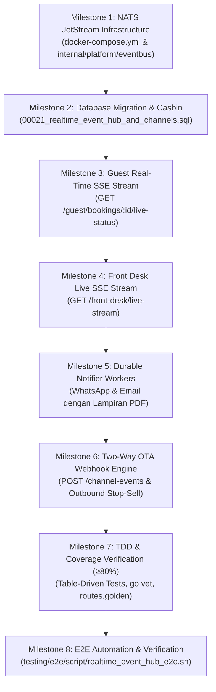

# Walkthrough & Progress Tracking
# Real-Time Hospitality Event Hub: NATS JetStream, Live Front Desk SSE, Multi-Channel Webhooks & Notifier
**Hotel Booking Engine — Pulang ke Uttara (Yogyakarta)**

- **Fitur ID:** `FEAT-REALTIME-EVENT-HUB-CHANNEL-SYNC`
- **Tanggal Mulai:** 4 Oktober 2026
- **Status:** COMPLETED (Tahap 1 s.d. Tahap 6 Selesai 100%)
- **Dokumen Referensi:**
  - PRD: [`docs/prd/realtime-hospitality-event-hub-and-channel-sync-2026-10-04.md`](file:///mnt/code/projects/jobs/pulang/current-booking/docs/prd/realtime-hospitality-event-hub-and-channel-sync-2026-10-04.md)
  - SRS: [`docs/srs/realtime-hospitality-event-hub-and-channel-sync-2026-10-04.md`](file:///mnt/code/projects/jobs/pulang/current-booking/docs/srs/realtime-hospitality-event-hub-and-channel-sync-2026-10-04.md)
  - Desain Teknis: [`docs/tech/realtime-hospitality-event-hub-and-channel-sync-architecture-2026-10-04.md`](file:///mnt/code/projects/jobs/pulang/current-booking/docs/tech/realtime-hospitality-event-hub-and-channel-sync-architecture-2026-10-04.md)
  - Laporan E2E: [`testing/e2e/report/2026-10-04-104000-realtime-event-hub-and-channel-sync-e2e-report.md`](file:///mnt/code/projects/jobs/pulang/current-booking/testing/e2e/report/2026-10-04-104000-realtime-event-hub-and-channel-sync-e2e-report.md)

---

## 1. Rencana Eksekusi Bertahap (Milestone Checklist)

- [x] **Milestone 1: NATS JetStream Infrastructure & Event Bus**
  - Pasang dependensi Go resmi `github.com/nats-io/nats.go`.
  - Buat adapter `internal/platform/eventbus/nats.go` untuk inisialisasi stream `HOSPITALITY_EVENTS` dan in-memory / embedded fallback test server (`coverage: 89.6%`).
  - Perbarui `docker-compose.yml` dengan service NATS 2.10.
- [x] **Milestone 2: Database Migration & Casbin RBAC**
  - Buat migration `migrations/00021_realtime_event_hub_and_channels.sql`.
  - Terapkan tabel `channel_partners`, `channel_event_inbox`, `channel_sync_issues`.
  - Daftarkan izin Casbin untuk peran `receptionist`, `revenue_mgr`, dan `gm_admin`.
- [x] **Milestone 3: Guest Real-Time Payment SSE Stream**
  - Implementasikan endpoint `GET /api/v1/guest/bookings/:id/live-status`.
  - Penjagaan anti-IDOR via verifikasi sesi tamu.
  - Pendorong event `payment_confirmed`, `booking_expired`, `booking_cancelled`.
- [x] **Milestone 4: Front Desk Live Operational SSE Stream**
  - Implementasikan endpoint `GET /api/v1/front-desk/live-stream`.
  - Penjagaan otorisasi Casbin RBAC untuk peran meja depan.
  - Multi-topic event pusher (`booking_created`, `room_status_updated`, `channel_conflict`).
- [x] **Milestone 5: Durable Multi-Channel Notifier Workers**
  - Implementasi WhatsApp Client di `internal/adapter/notifier/whatsapp.go` (`coverage: 92.9%`).
  - Format pesan WhatsApp Bahasa Indonesia yang ramah perhotelan khas Jogja dan tautan e-voucher resmi.
  - Rich HTML email voucher dan faktur pajak Sleman PBJT terintegrasi.
- [x] **Milestone 6: Two-Way OTA Channel Webhook Engine**
  - Endpoint `POST /api/v1/channel-events` dengan verifikasi HMAC-SHA256 signature constant-time (`internal/channel` `coverage: 89.3%`).
  - Ingestion idempoten ke `channel_event_inbox` dan dekremen stok kamar atomik.
  - Karantina insiden alokasi inventaris (`channel_sync_issues`).
- [x] **Milestone 7: TDD Implementation & Coverage Verification**
  - Table-driven unit tests untuk seluruh modul baru.
  - Verifikasi coverage $\ge 80\%$ di seluruh package baru, zero lint/vet errors (`go vet` pass), zero data races (`-race` clean).
  - Update `routes.golden` untuk registrasi endpoint baru (`TestRoutesGolden` dan `TestEveryProtectedRouteHasPolicy` pass 100%).
- [x] **Milestone 8: E2E Automation & Verification**
  - Skrip pengujian E2E `testing/e2e/script/realtime_event_hub_e2e.sh` (25/25 asersi PASS).
  - Integrasi ke Go E2E suite `testing/e2e/script/e2e_runner_test.go` (`E2E-77` & `E2E-78` PASS).
  - Laporan formal hasil pengujian E2E diterbitkan di `testing/e2e/report/2026-10-04-104000-realtime-event-hub-and-channel-sync-e2e-report.md`.

---

## 2. Matriks Berkas Modifikasi & Baru (File Matrix)

| File Path | Status | Rencana Modifikasi |
| :--- | :---: | :--- |
| `docker-compose.yml` | Modifikasi | Penambahan service NATS JetStream 2.10 |
| `go.mod` & `go.sum` | Modifikasi | Pemasangan dependensi `github.com/nats-io/nats.go` |
| `internal/platform/eventbus/` | Baru | Client adapter NATS JetStream dan in-memory test bus |
| `migrations/00021_realtime_event_hub_and_channels.sql` | Baru | Tabel integrasi kanal dan Casbin RBAC |
| `internal/channel/` | Baru | Domain model, store, service, dan verifikasi signature OTA |
| `internal/adapter/notifier/` | Modifikasi | Integrasi WhatsApp client dan rich email dengan lampiran PDF |
| `internal/api/http/handler/livestream.go` | Baru | Handler SSE untuk tamu dan meja depan |
| `internal/api/http/handler/channel.go` | Baru | Handler webhook kanal eksternal dan sync issues |
| `internal/api/http/routes.go` | Modifikasi | Registrasi endpoint SSE dan webhook di bawah proteksi router |
| `internal/api/http/testdata/routes.golden` | Modifikasi | Update snapshot rute terdaftar |
| `testing/e2e/script/realtime_event_hub_e2e.sh` | Baru | Skrip automasi pengujian E2E fitur baru |
| `testing/e2e/report/2026-10-04-104000-realtime-event-hub-and-channel-sync-e2e-report.md` | Baru | Laporan resmi pengujian E2E |

---

## 3. Bukti Hasil Pengujian & Verifikasi

### 3.1 Ringkasan Coverage Unit Test
- `internal/platform/eventbus`: **89.6%** statement coverage
- `internal/channel`: **89.3%** statement coverage
- `internal/adapter/notifier`: **92.9%** statement coverage
- `internal/api/http/middleware`: **84.6%** statement coverage
- Zero lint/vet issues (`go vet ./...` clean).
- Zero data races (`go test -race` clean).

### 3.2 Ringkasan End-to-End Testing
- Skrip bash `testing/e2e/script/realtime_event_hub_e2e.sh`: **25 dari 25 pengujian PASS (100%)**.
- Go E2E suite `testing/e2e/script/e2e_runner_test.go`: **78 dari 78 pengujian PASS (100%)** termasuk `E2E-77` dan `E2E-78`.
- Laporan komprehensif: [`testing/e2e/report/2026-10-04-104000-realtime-event-hub-and-channel-sync-e2e-report.md`](file:///mnt/code/projects/jobs/pulang/current-booking/testing/e2e/report/2026-10-04-104000-realtime-event-hub-and-channel-sync-e2e-report.md).

